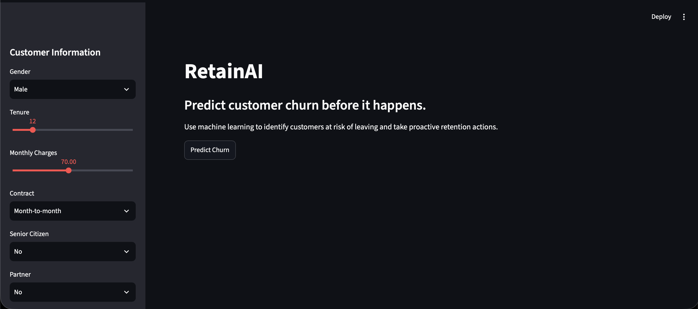
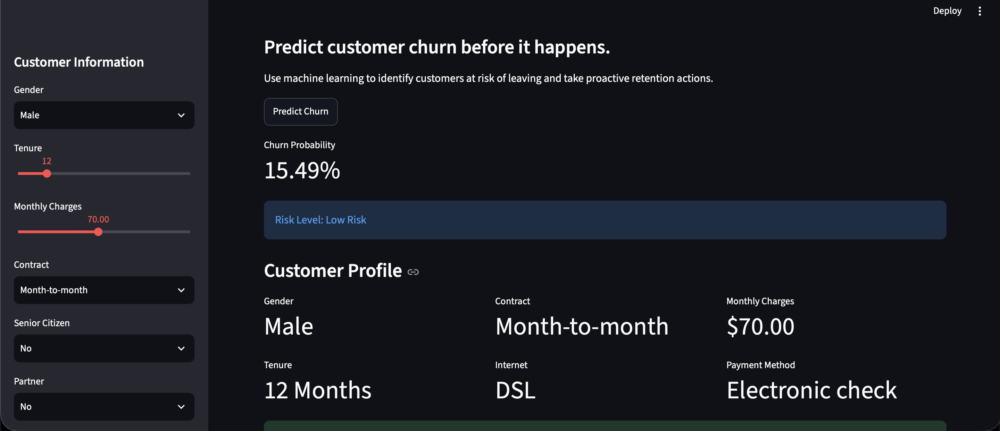

# RetainAI 

AI-powered customer churn prediction platform with explainable machine learning and actionable retention recommendations.

---


[](https://retainai2407.streamlit.app)


##  Overview

RetainAI is an end-to-end machine learning application designed to help businesses identify customers at risk of leaving before churn occurs.

The application leverages a Gradient Boosting Machine learning model along with SHAP explainability to not only predict customer churn probability but also explain *why* the prediction was made and suggest business actions to improve customer retention.

---

##  Features

*  Customer churn probability prediction
*  Risk level classification

  *  Low Risk
  *  Medium Risk
  *  High Risk
*  SHAP explainability visualizations
*  Retention strategy recommendations
*  Customer profile dashboard
*  Real-time predictions through Streamlit
*  Feature engineering pipeline integrated with deployment

---

##  Machine Learning Pipeline

### Data Preprocessing

* Missing value handling
* Categorical feature encoding
* Numerical feature scaling
* Pipeline-based preprocessing using Scikit-Learn

### Feature Engineering

Additional features created:

* `TotalCharges`
* `MonthlyCategory`
* `TenureGroup`

### Model

The final model uses:

* Gradient Boosting Classifier

The complete preprocessing and modeling workflow is stored inside a Scikit-Learn Pipeline to ensure consistency between training and deployment.

---

##  Explainable AI

RetainAI uses SHAP (SHapley Additive exPlanations) to provide model interpretability.

This allows users to understand:

* Which features increase churn probability.
* Which features reduce churn probability.
* The relative contribution of each feature toward the prediction.

---

##  Business Recommendations

RetainAI provides retention strategies based on customer profiles, such as:

* Offer discounted annual contracts.
* Provide premium technical support.
* Encourage automatic payment methods.
* Introduce loyalty incentives for new customers.

---

##  Project Structure

```text
RetainAI/
│
├── app.py
├── requirements.txt
├── model/
│   └── gb_model.pkl
├── notebook/
│   └── customer_churn.ipynb
├── dataset
│   └── WA_Fn-UseC_-Telco-Customer-Churn.csv
│   └── WA_Fn-UseC_-Telco-Customer-Churn.xls
├── images/
│   └──retention_strategy.png
│   └──dashboard1.png
│   └──dashboard2.png
│   └──shap_explainability.png


```

---

##  Tech Stack

### Machine Learning

* Scikit-Learn
* Gradient Boosting
* SHAP

### Data Processing

* Pandas
* NumPy

### Visualization

* Matplotlib
* SHAP Plots

### Deployment

* Streamlit

---

##  Dataset

Dataset used:

**Telco Customer Churn Dataset**

Target Variable:

* `Churn`

  * Yes
  * No

Number of samples:

* 7043 customers

---

##  Model Performance

### Gradient Boosting Classifier

| Metric                      | Score |
| --------------------------- | ----- |
| Accuracy                    | ~80%  |
| Cross Validation Accuracy   | ~80%  |
| Recall (Churn Customers)    | ~52%  |
| Precision (Churn Customers) | ~65%  |

---

##  Running Locally

Clone the repository:

```bash
git clone https://github.com/YOUR_USERNAME/RetainAI.git
```

Move into the project directory:

```bash
cd RetainAI
```

Create virtual environment:

```bash
python -m venv my_env
```

Activate environment:

### Windows

```bash
my_env\Scripts\activate
```

### macOS/Linux

```bash
source my_env/bin/activate
```

Install dependencies:

```bash
pip install -r requirements.txt
```

Run Streamlit:

```bash
streamlit run app.py
```

---

##  Deployment

RetainAI is deployed using Streamlit Cloud.

---

##  Screenshots

### Dashboard




### SHAP Explainability


### Retention Recommendations


---

##  Future Improvements

* Customer segmentation using clustering.
* Probability gauge visualization.
* PDF report generation.
* Customer lifetime value estimation.
* Multi-model comparison dashboard.
* Authentication and user accounts.
* Cloud database integration.

---

## Live Demo
Link: https://retainai2407.streamlit.app

---

##  Author

**GodofThunder2407(RL Yuwin)**

Aspiring Machine Learning Engineer focused on building explainable AI systems and real-world machine learning products.

GitHub: https://github.com/Yuwin2008

---

##  License

This project is licensed under the MIT License.

---

##  If you found this project useful

Please consider giving the repository a star.
